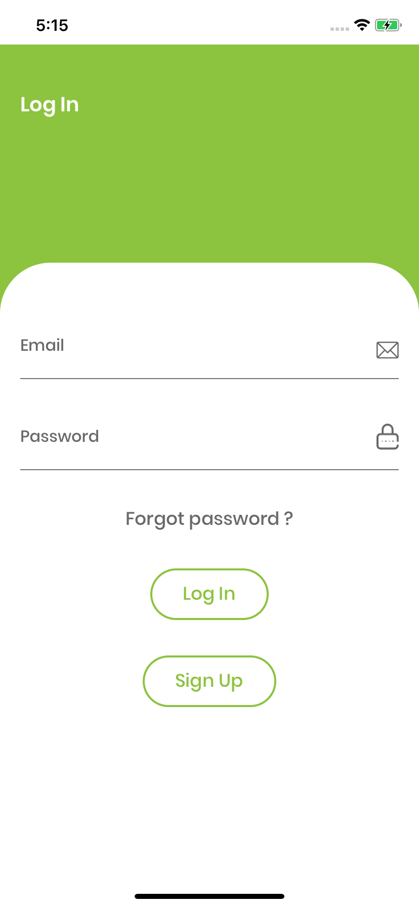
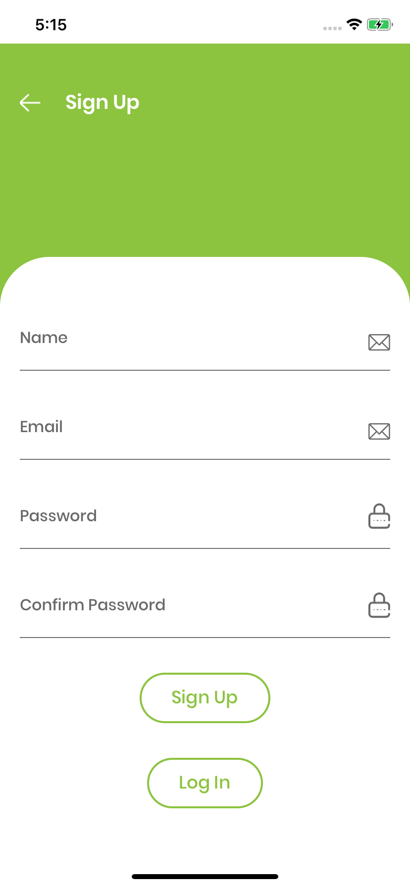
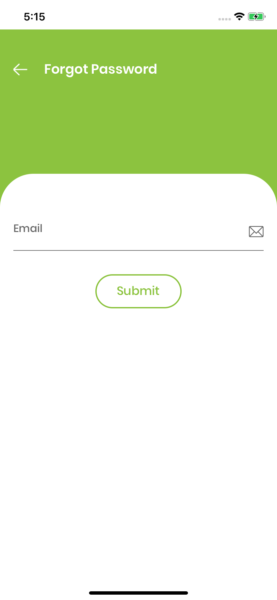
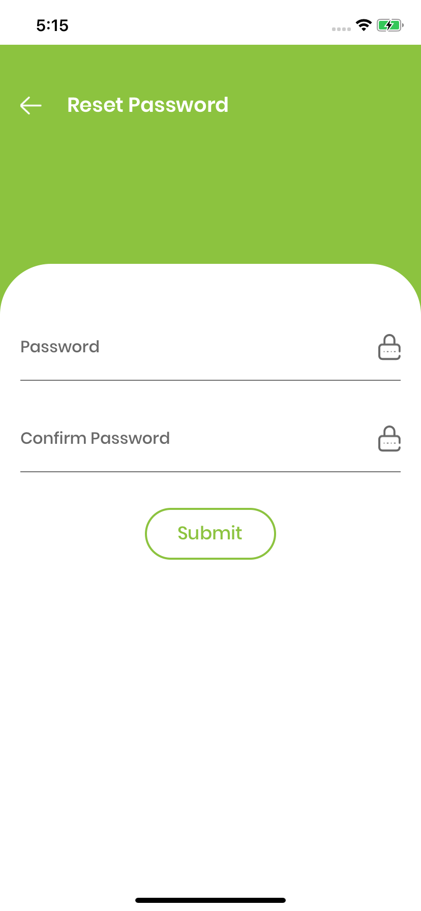
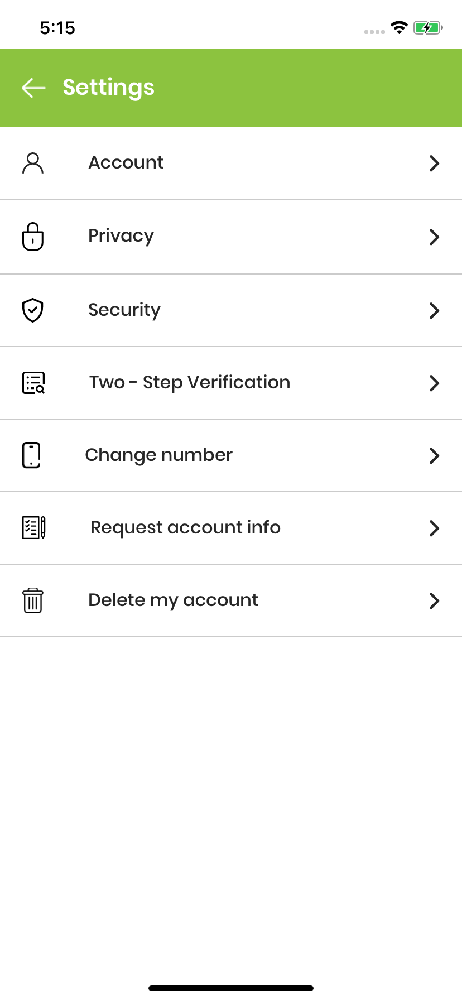
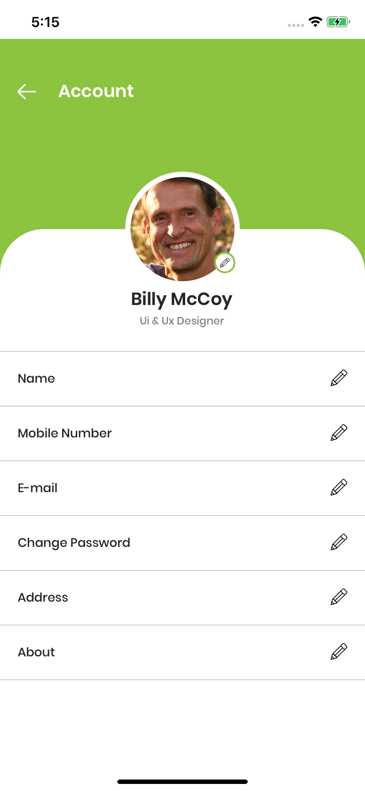

# React Native Auth UI

UI Screens for Login, Signup, Forgot password and Reset password screens for React-Native.

## Preview
<p align="center">
  
  
  
  
</p>
<p align="center">
  
  
  
</p>
## Installation
.

```bash
git clone https://github.com/zestgeek/react-native-auth-ui.git
cd react-native-auth-ui
yarn
```

## Usage

```python
npx react-native run-ios 
```

## Contributing
Pull requests are welcome. For major changes, please open an issue first to discuss what you would like to change.

Please make sure to update tests as appropriate.

## Contributers
* [lovetrivedi](https://github.com/lovetrivedi) - Love Trivedi
* [ramkumar897003](https://github.com/ramkumar897003) - Ram Kumar

## License
[MIT](https://choosealicense.com/licenses/mit/)
